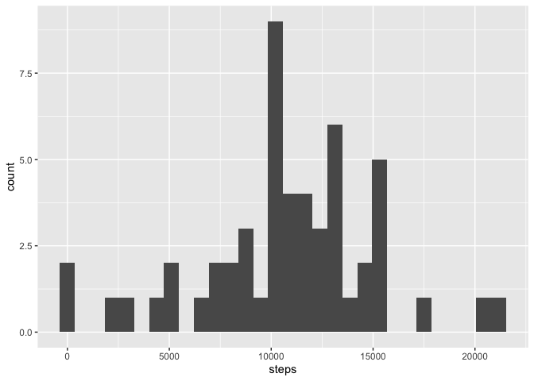
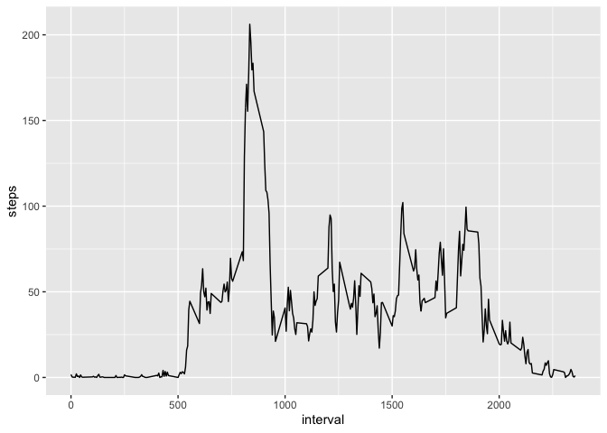
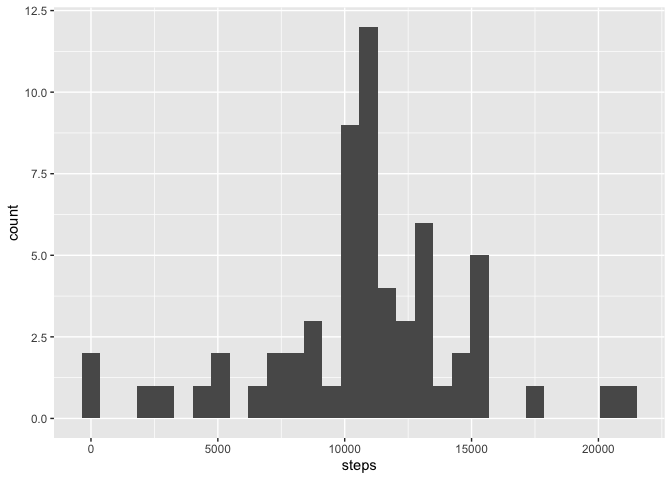
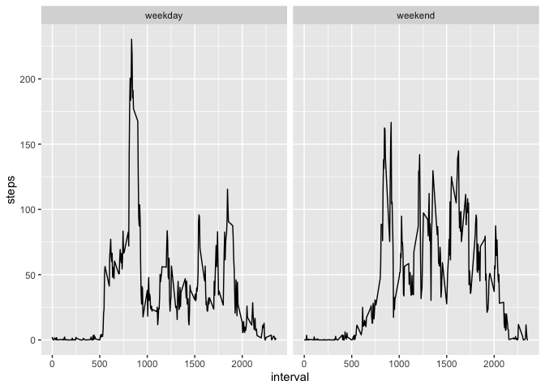
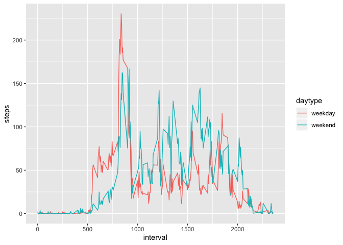

## Loading and preprocessing the data

```r
library(dplyr)
```

```
## 
## Attaching package: 'dplyr'
```

```
## The following objects are masked from 'package:stats':
## 
##     filter, lag
```

```
## The following objects are masked from 'package:base':
## 
##     intersect, setdiff, setequal, union
```

```r
library(ggplot2)
```

```r
data <- read.csv("activity.csv")
data$date <- as.Date(data$date)
data$datetime <- as.POSIXct(
  paste(data$date, sprintf("%04d", data$interval)),
  format = "%Y-%m-%d %H%M")
str(data)
```

```
## 'data.frame':	17568 obs. of  4 variables:
##  $ steps   : int  NA NA NA NA NA NA NA NA NA NA ...
##  $ date    : Date, format: "2012-10-01" "2012-10-01" ...
##  $ interval: int  0 5 10 15 20 25 30 35 40 45 ...
##  $ datetime: POSIXct, format: "2012-10-01 00:00:00" "2012-10-01 00:05:00" ...
```

## What is mean total number of steps taken per day?

```r
total_by_date <- data %>%
  filter(!is.na(steps)) %>%
  group_by(date) %>%
  summarize(sum(steps))
colnames(total_by_date) <- c("date", "steps")

ggplot(total_by_date, aes(steps)) + geom_histogram(bins = 30)
```

<!-- -->

```r
mean_steps <- mean(total_by_date$steps)
median_steps <- median(total_by_date$steps)
```
* Mean steps in a day: **10766.19**
* Median steps in a day: **10765**

## What is the average daily activity pattern?

```r
mean_by_interval <- data %>%
  filter(!is.na(steps)) %>%
  group_by(interval) %>%
  summarize(mean(steps))
colnames(mean_by_interval) <- c("interval", "steps")

ggplot(mean_by_interval, aes(interval, steps)) + geom_line()
```

<!-- -->

```r
top_time <- top_n(mean_by_interval, 1, steps)
hour <- floor(top_time$interval / 100)
minute <- top_time$interval %% 100
```
Interval with the most steps: **08:35** (**206.17** steps on average)


## Inputing missing values

```r
missing_values <- sum(!complete.cases(data))
```
Total number of input data rows with missing values: **2304**

I have chosen to fill in the missing values using the mean values of the interval over the whole data set. There seem to be whole days with nothing but NA as steps, so using the days' median doesn't seem to be useful.

```r
filled_data <- data
filled_data$mean_steps <- rep(mean_by_interval$steps)
filled_data$steps <- with(filled_data,
                          ifelse(is.na(steps), mean_steps, steps))
filled_data <- filled_data[, -4]

filled_total_by_date <- filled_data %>%
  group_by(date) %>%
  summarize(sum(steps))
colnames(filled_total_by_date) <- c("date", "steps")

ggplot(filled_total_by_date, aes(steps)) + geom_histogram(bins = 30)
```

<!-- -->

```r
filled_mean_steps <- mean(filled_total_by_date$steps)
filled_median_steps <- median(filled_total_by_date$steps)
```
* Mean steps in a day: **10766.19** (**10766.19** before filling)
* Median steps in a day: **10766.19** (**10765** before filling)

The mean has not changed, but the median has, as there are now more days close to the mean value.

## Are there differences in activity patterns between weekdays and weekends?

```r
filled_data$weekday <- weekdays(filled_data$date)
filled_data$daytype <- as.factor(
  ifelse(filled_data$weekday %in% c("Saturday", "Sunday"),
         "weekend",
         "weekday"))
mean_by_daytype <- filled_data %>%
  group_by(daytype, interval) %>%
  summarise(mean(steps))
colnames(mean_by_daytype) <- c("daytype", "interval", "steps")

ggplot(mean_by_daytype, aes(interval, steps)) + geom_line() + facet_grid(~ daytype)
```

<!-- -->

```r
ggplot(mean_by_daytype, aes(interval, steps, colour = daytype)) + geom_line()
```

<!-- -->
